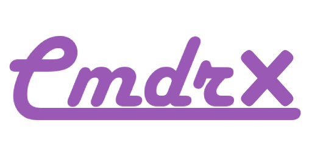

	<table>
		<tr>
			<td>
				
			</td>
			<td align="center">
				
				
			</td>
		</tr>
	</table>
	 
	
<strong>CmdrX</strong> is a fully extensible and type-safe command console for Roblox developers.

	<ul>
		<li>Great for admin commands, but does much more.</li>
		<li>Make commands that tie in specifically with your game systems.</li>
		<li>Intelligent autocompletion and instant validation.</li>
		<li>Run commands programmatically on behalf of the local user.</li>
		<li>Bind commands to user input.</li>
		<li>Secure: the client and server both validate input separately.</li>
		<li>Embedded commands: dynamically use the output of an inner command when running a command.</li>
	</ul>
	
<strong>This project is a fork of Cmdr by Eryn L. K. Both projects are licensed under the MIT License.</strong>

